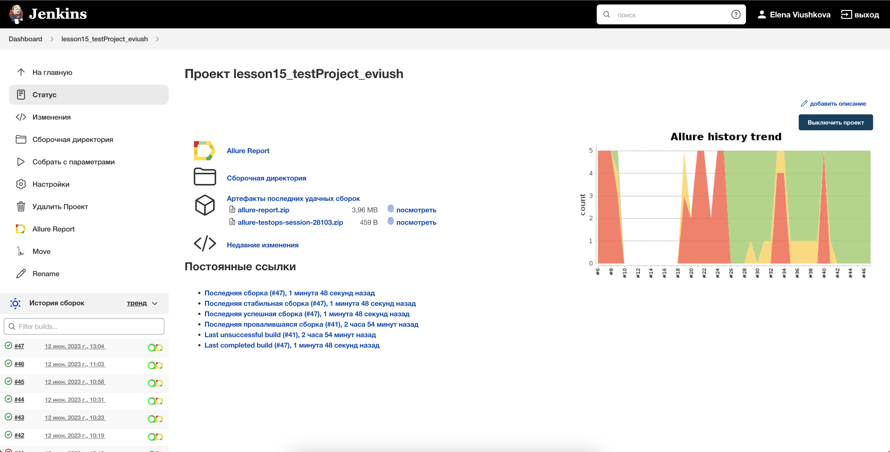
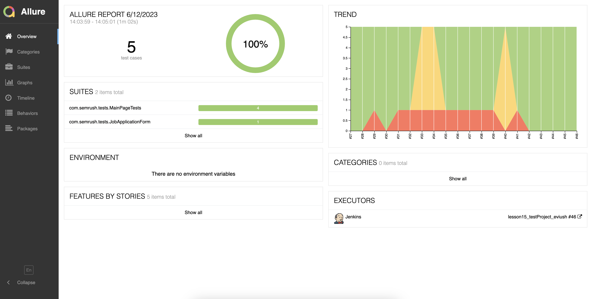
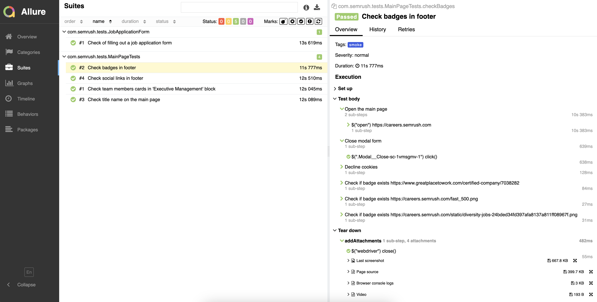
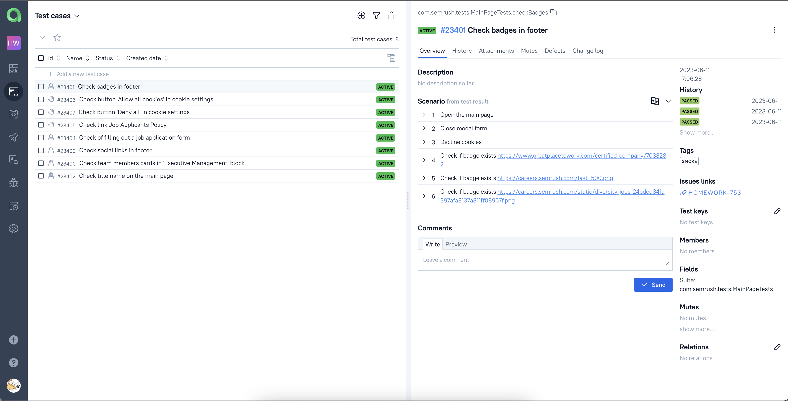
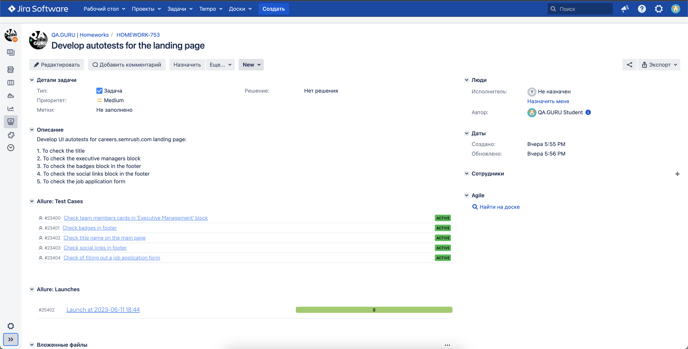
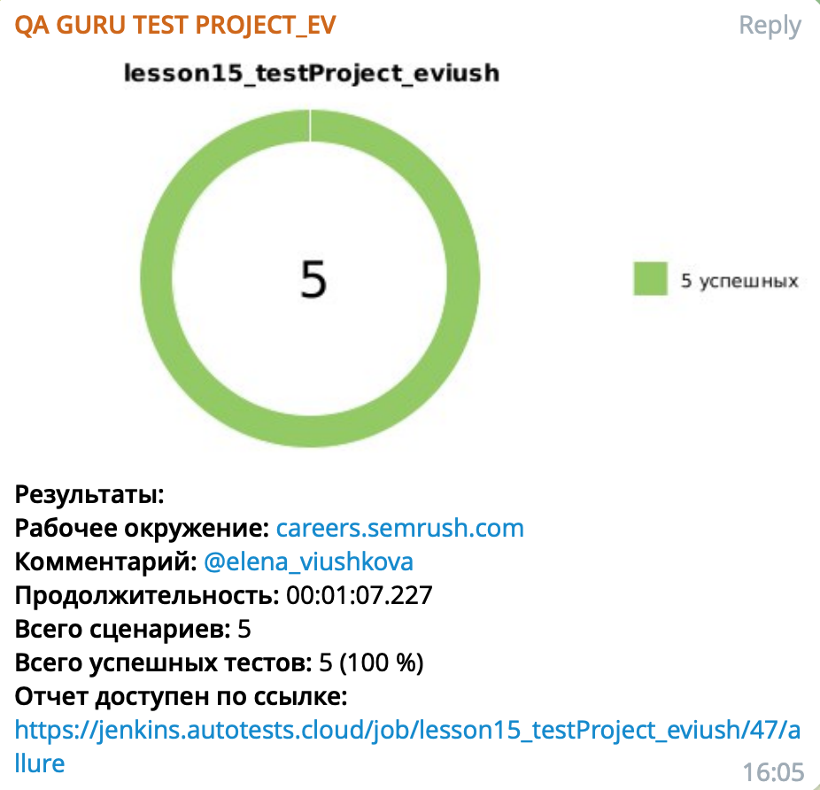
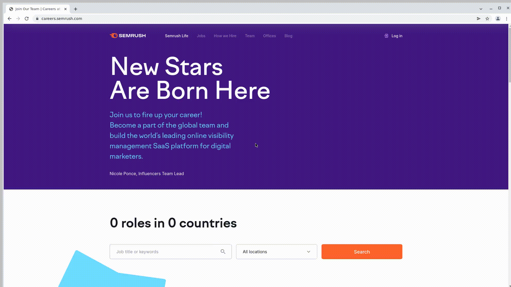

# Automated tests for [careers.semrush.com](https://careers.semrush.com/)

> Semrush Holdings, Inc. is an American public company that offers a SaaS platform known as Semrush. The platform is often used for keyword research and online ranking data, including metrics such as search volume, Keyword research and cost per click.

## :pushpin: Content:

- [Stack of technologies](#computer-stack-of-technologies)
- [Running tests](#running_woman-running-tests)
- [Build in Jenkins](#-build-in-jenkins)
- [Allure report](#-allure-report)
- [Allure TestOps Integration](#-allure-testops-integration)
- [Jira Integration](#-jira-integration)
- [Telegram notifications](#-telegram-notifications)
- [Video of an example of running a test in Selenoid](#-video-of-an-example-of-running-a-test-in-selenoid)


## :computer: Stack of technologies

<p align="center">


</p>


**Allure report includes:**

* Test execution steps (of automated and manual tests)
* Screenshot of the last step
* Page Source
* Browser console logs
* Video of run


## :rocket: Running tests

If necessary, you can override the launch options:

```
clean
${TASK}
-Dbase_url=${BASE_URL}
-Dbrowser=${BROWSER}
-Dbrowser_size=${SIZE}
-Dselenoid_url=${SELENOID_URL}
-Dselenoid_login_password="${SELENOID_LOGIN}:${SELENOID_PASSWORD}"
```

### Build options

* <code>TASK</code> is the name of the task. The default is <code>test</code> to run all of them.
* <code>BROWSER</code> is the browser in which the tests will be run. The default is <code>chrome</code>.
* <code>VERSION</code> is the browser version in which the tests will be run. The default is <code>100.00</code>.
* <code>SIZE</code> is the size of the browser window in which tests will be run. The default is <code>1920x1080</code>
* <code>SELENOID_URL</code> is the address of the remote server where the tests will be run.


##  Build in [Jenkins](https://jenkins.autotests.cloud/job/lesson15_testProject_eviush/)
<p align="center">


</p>

##  [Allure](https://jenkins.autotests.cloud/job/lesson15_testProject_eviush/47/allure/) report
### Overview

<p align="center">

</p>

### Test result

<p align="center">

</p>

##  [Allure TestOps](https://allure.autotests.cloud/launch/25480) Integration

Also we can connect <code>Jenkins</code> to the commercial version of <code>Allure</code>, which provides an opportunity to add there manual tests as well as an automated ones:

<p align="center">

</p>

##  [Jira](https://jira.autotests.cloud/browse/HOMEWORK-753) Integration

And also we can see from <code>Jira</code>, which tests been added to <code>Allure</code> with their statuses

<p align="center">

</p>

##  Telegram notifications

<p align="center">

</p>

##  Video of an example of running a test in Selenoid

A video is attached to each test in the report. One of these videos is shown below.
<p align="center">
  
</p>